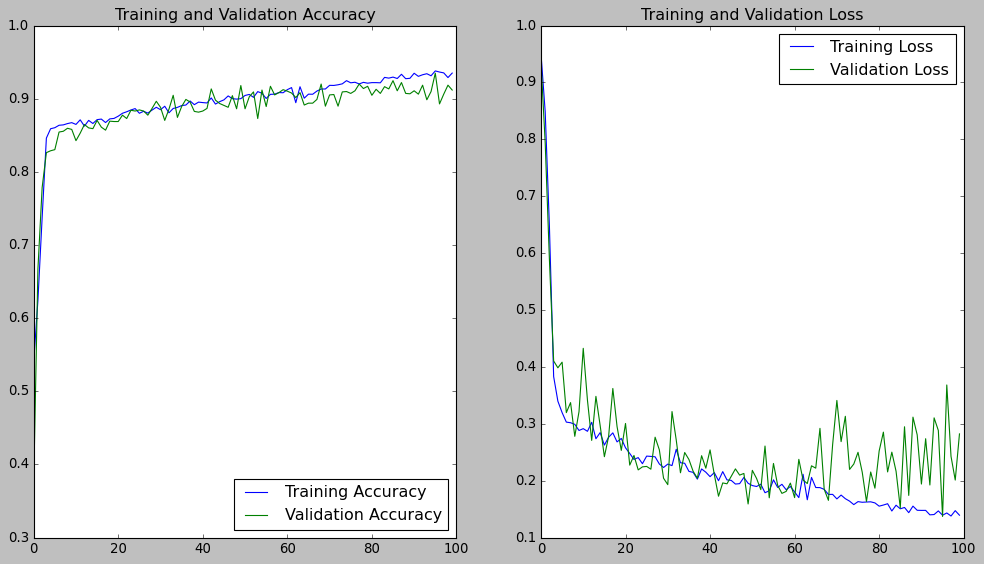

# Capstone-Project
 A tensorflow model that can differentiate between different types of steel microstructures. The model was trained on a modified version of the dataset provided from the following:

 
 Zongrui Pei, Kyle A. Rozman, mer N. Doan, Youhai Wen, Nan Gao, Elzabeth A. Holm, Jeffery A. Hawk, David E. Alman, Michael C. Gao, Machine-Learning Microstructure for Inverse Material Design, Advanced Science, Vol 8, Issue 23, 2021, https://doi.org/10.1002/advs.202101207, DOI: 10.18141/1843846

 
Modifications made:
1. Cropped and resized each image to be 400x400 pixels.2. All images were flipped 90 degrees to the right and left and saved as new images.
3. Each images' horizontal and vertical reflections were also saved as new images.

Current results:

epochs trained is 100
training loss: 0.1393 - training accuracy: 0.9350 - val_loss: 0.2822 - val_accuracy: 0.9118

